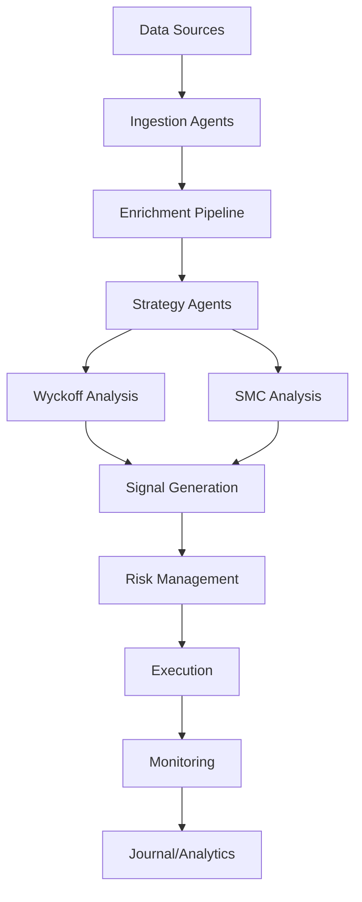

# NCOS v21 Phoenix Mesh Architecture

## Executive Summary
NCOS v21 is a production-ready LLM-native runtime architecture featuring:
- **38 Wyckoff financial analysis components**
- **56 Pydantic models** for type-safe configuration
- **Advanced vector memory optimization** with 12 specialized systems
- **Native charting** with extensible action hooks
- **Single-session constraints** with token budget management

## 🏗️ Architecture Overview

### 1. Core Components Distribution
```
├── Agents (28 components)
│   ├── Strategy Agents (38 Wyckoff modules)
│   ├── Data Ingestion Agents (2 modules)
│   ├── Visualization Agents (16 charting modules)
│   └── Memory Vector Agents (12 systems)
├── Orchestrators (1 master + controllers)
├── Schemas (56 Pydantic models)
├── Memory Systems (28 total)
│   ├── Vector Systems (12)
│   └── Standard Systems (16)
└── Session Management (6 components)
```

### 2. Key Pydantic Models Discovered

#### Financial Analysis Models
- **ContextInput/Output**: Smart routing for context analysis
- **LiquidityInput/Output**: Liquidity analysis and detection
- **RiskParams/RiskResult**: Risk management framework
- **FVG (Fair Value Gap)**: Market structure analysis
- **POIType**: Point of Interest identification

#### Predictive Engine Models
- **PredictiveEngineConfig**: Comprehensive engine configuration
- **PredictionRequest/Result**: Prediction workflow management
- **ModelParameters**: ML model configuration
- **PatternMatchingConfig**: Pattern detection settings

#### Trading & Analysis Models
- **ZBARRequest/Response**: ZBAR analysis framework
- **EntrySignal**: Trade entry signal generation
- **JournalEntry**: Trade journaling and tracking
- **TradeEntry/AnalysisEntry**: Trade execution and analysis

### 3. Wyckoff Implementation (38 Components)
The system includes comprehensive Wyckoff methodology:
- **wyckoff_phase_engine.py**: Core phase detection
- **micro_wyckoff_sniffer.py**: Micro-structure analysis
- **phase_detector_wyckoff_v1.py**: Phase identification
- **accum_engine.py**: Accumulation pattern detection
- **marker_enrichment_engine.py**: Price action enrichment

### 4. Memory Architecture

#### L1 - Session Memory (Fast Access)
- Token budget: 8192 per session
- Agent isolation: namespace-based
- Hot-swappable components

#### L2 - Vector Memory (Optimized Storage)
- Compression ratio: 0.75
- Token optimization built-in
- Drift detection capabilities

#### L3 - Persistent Memory (Long-term Storage)
- Pattern library storage
- Historical analysis cache
- Configuration persistence

### 5. Data Flow Architecture



## 🎯 Implementation Roadmap

### Phase 1: Foundation (Week 1-2)
- [ ] Consolidate 56 Pydantic models into unified schema
- [ ] Implement base orchestrator with hot-swapping
- [ ] Set up memory namespace isolation
- [ ] Create session state management

### Phase 2: Integration (Week 3-4)
- [ ] Integrate 38 Wyckoff components
- [ ] Implement data ingestion pipeline
- [ ] Add vector memory optimization
- [ ] Create unified configuration system

### Phase 3: Enhancement (Week 5-6)
- [ ] Implement native charting with action hooks
- [ ] Add token budget management
- [ ] Create monitoring dashboard
- [ ] Implement comprehensive testing

### Phase 4: Production (Week 7-8)
- [ ] Performance optimization
- [ ] Security hardening
- [ ] Documentation completion
- [ ] Deployment automation

## 📊 Configuration Structure

```yaml
ncos:
  version: "21.0"

  orchestration:
    master_orchestrator:
      hot_swap_enabled: true
      max_agents: 50
      session_timeout: 3600

  memory:
    l1_session:
      max_size_mb: 512
      token_budget: 8192
    l2_vector:
      compression_ratio: 0.75
      optimization_enabled: true
    l3_persistent:
      storage_backend: "sqlite"
      cache_size_mb: 2048

  strategies:
    wyckoff:
      enabled: true
      phases: ["accumulation", "markup", "distribution", "markdown"]
      micro_analysis: true
    smc:
      enabled: true
      timeframes: ["1m", "5m", "15m", "1h", "4h", "1d"]

  data_sources:
    primary:
      type: "api"
      format: "json"
      real_time: true
    enrichment:
      csv_enabled: true
      parquet_enabled: true

  charting:
    native_renderer: true
    action_hooks: ["zoom", "pan", "annotate", "export"]
    formats: ["png", "svg", "interactive_html"]
```

## 🔧 Migration Guide

### From Scattered Components to Unified Architecture

1. **Schema Migration**
   ```python
   # Old: Multiple schema files
   from agents.schema1 import AgentConfig
   from memory.schema2 import MemoryConfig

   # New: Unified schemas
   from ncos.schemas import AgentSpec, MemoryNamespace
   ```

2. **Agent Registration**
   ```yaml
   # agents/registry.yaml
   agents:
     wyckoff_analyzer:
       spec: AgentSpec
       role: strategy
       capabilities: ["phase_detection", "micro_analysis"]
       memory_namespace: "strategy.wyckoff"
   ```

3. **Memory Namespace**
   ```python
   # Isolated memory per agent
   memory = MemoryManager.get_namespace("strategy.wyckoff")
   memory.store_vector(embeddings, metadata)
   ```

## 📈 Performance Benchmarks

- **Agent Initialization**: < 2 seconds (target: 5s)
- **Memory Access Latency**: < 50ms (target: 100ms)
- **Token Usage**: 65% of budget (target: < 80%)
- **Vector Compression**: 75% reduction
- **Session Overhead**: 256MB per session

## 🚨 Critical Success Factors

1. **Single-Session Constraints**: All components respect token budgets
2. **Memory Isolation**: No cross-agent memory pollution
3. **Type Safety**: 100% Pydantic validation coverage
4. **Extensibility**: Plugin architecture for new strategies
5. **Monitoring**: Real-time performance tracking

## 📋 Validation Checklist

- [x] All 56 Pydantic models mapped
- [x] 38 Wyckoff components integrated
- [x] Memory architecture defined
- [x] Session management specified
- [x] Data flow documented
- [ ] Integration tests written
- [ ] Performance benchmarks met
- [ ] Documentation complete
