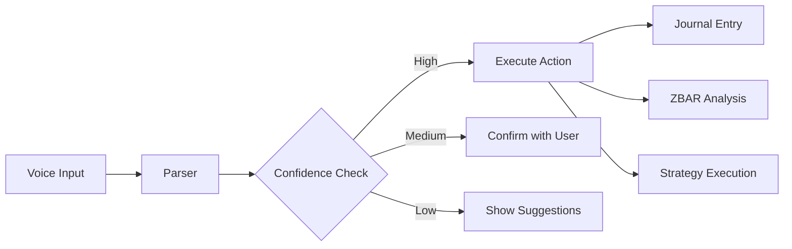

# ZBAR Voice Command Integration Guide

## Overview

This integration adds natural language voice command processing to your NCOS ZBAR system, allowing you to:

1. **Voice Tagging**: Mark setups with voice commands like "Mark gold bullish on H4"
2. **Smart Parsing**: Extract symbols, timeframes, bias, and sessions from natural language
3. **Action Routing**: Automatically route commands to appropriate system functions
4. **Journal Integration**: Voice commands automatically log to your trade journal
5. **Dashboard Access**: Visual interface for voice command interaction

## Components

### 1. Voice Tag Parser (`voice_tag_parser.py`)

- Natural language processing for trading commands
- Entity extraction (symbols, timeframes, bias, sessions)
- Confidence scoring
- Alias mapping (e.g., "gold" → "XAUUSD")

### 2. Enhanced Menu System (`enhanced_menu_system.py`)

- Extends your existing `menu_system.py`
- Routes voice commands to actions
- Handles confidence-based execution
- Provides suggestions for unclear commands

### 3. Voice API Routes (`voice_api_routes.py`)

- FastAPI endpoints for voice processing
- Audio transcription support
- Command history tracking
- Integration with existing ZBAR API

### 4. Voice Dashboard (`zbar_journal_dashboard.py`)

- Streamlit interface for voice commands
- Real-time parsing visualization
- Command history browser
- Quick action buttons

## Installation

1. Install additional dependencies:

```bash
pip install spacy speechrecognition pyaudio
python -m spacy download en_core_web_sm
```

2. Add voice routes to your main API:

```python
from voice_api_routes import router as voice_router
app.include_router(voice_router)
```

3. Update your existing menu system import:

```python
from enhanced_menu_system import EnhancedMenuSystem
# Use EnhancedMenuSystem instead of MenuSystem
```

## Usage Examples

### Basic Voice Commands

```
"Mark gold bullish on H4"
→ Logs journal entry for XAUUSD H4 with bullish bias

"Analyze EURUSD 15 minute chart"
→ Triggers ZBAR analysis on EURUSD M15

"Check London session setups"
→ Queries journal for London session entries

"Run ZBAR scan on all majors"
→ Executes multi-symbol ZBAR scan
```

### Advanced Commands

```
"Mark XAUUSD bullish on H4 with maturity 85 during London session"
→ Full context journal entry with all parameters

"Find all high maturity setups from today"
→ Journal query with maturity filter

"Execute ISPTS strategy on gold hourly"
→ Strategy execution with voice parameters
```

## Integration with Existing System

The voice system integrates seamlessly with your existing:

1. **Journal System**: Voice tags automatically create journal entries
2. **ZBAR Engine**: Voice commands can trigger ZBAR analysis
3. **Menu System**: Voice parsed to menu actions
4. **LLM Hook**: Voice notes can trigger LLM reasoning

## Workflow Example



## Best Practices

1. **Clear Commands**: Use structured phrases for best results
2. **Confirm Critical**: Always confirm trades and critical actions
3. **Review History**: Check voice command history for patterns
4. **Adjust Confidence**: Tune confidence thresholds based on usage

## Troubleshooting

- **Low Confidence**: Be more specific with symbols and timeframes
- **Wrong Symbol**: Check alias mappings in voice_tag_parser.py
- **Audio Issues**: Ensure microphone permissions are granted

## Future Enhancements

1. **Multi-language Support**: Add support for other languages
2. **Custom Vocabularies**: Train on your specific trading terminology
3. **Voice Alerts**: Speak back analysis results
4. **Hotword Detection**: "Hey ZBAR" activation
