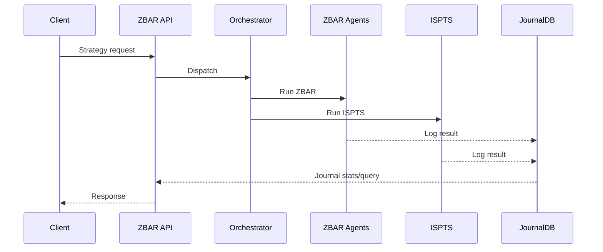

# ZBAR Trade Intelligence Overview

This document provides a high level summary of how the ZBAR trading intelligence components operate together in NCOS v21.7.

## Pipeline

The system exposes a REST API (see `_21.7.2_verify/ZBAR_API_DEPLOYMENT.md`) that accepts client requests. Incoming data flows through the API to the orchestrator layer, which then triggers ZBAR analysis and the ISPTS strategy pipeline. Results are logged in the JournalDB for later querying.



## JournalDB and Journal API

Trading activity is stored in a persistent journal (`trade_journal.jsonl` by default). The journal API exposed by `ncos_zbar_api.py` provides endpoints to append new entries or query historical data:

```text
POST /journal/append  – add new entry
GET  /journal/query   – filter entries (symbol, strategy, session, trace_id)
GET  /journal/stats   – summary statistics
```

Refer to the detailed interface description in `_21.7.2_verify/NCOS_Voice_Journal_Documentation.md` for more information on these endpoints.

## Typical Workflow

1. A client or the voice dashboard submits a strategy execution request.
2. The API forwards the request to the master orchestrator.
3. The orchestrator coordinates ZBAR agents and the ISPTS workflow to perform analysis.
4. Results and metadata are written to the JournalDB via the journal API.
5. Subsequent queries can retrieve summaries or individual trades.

This workflow enables a repeatable and auditable process for running market analysis and capturing session data.

## Benefits

- **Centralized API** simplifies integration with external tools or the voice journal system.
- **Persistent Journal** allows tracking strategy performance and reviewing past trades even after restarts.
- **ISPTS Pipeline** works with ZBAR analysis to provide structured setups and maturity scoring.

For deployment instructions and additional examples see:

- `_21.7.2_verify/ZBAR_API_DEPLOYMENT.md` – API installation and usage
- `docs/QUICK_START_Voice_Journal_v21.7.2.md` – using the voice interface with the journal system
